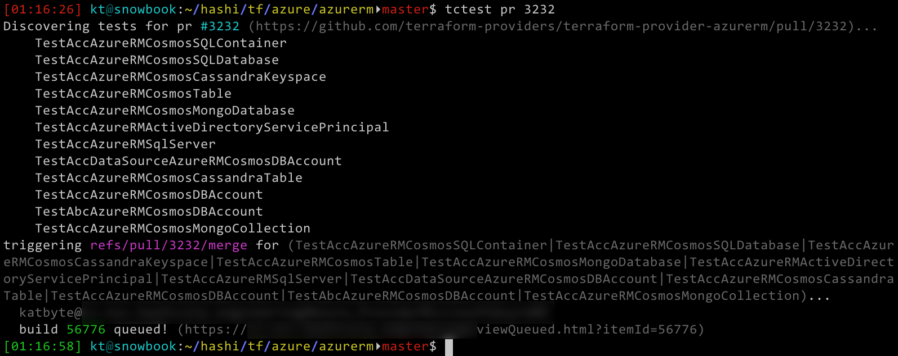
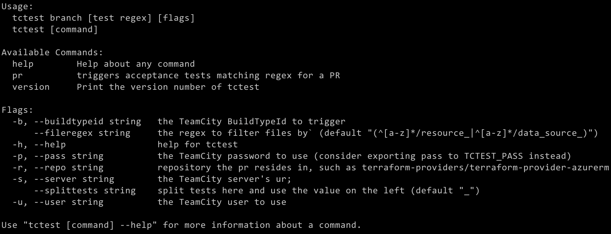
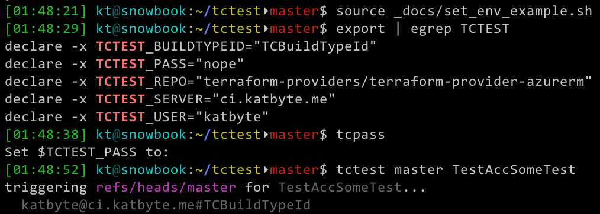
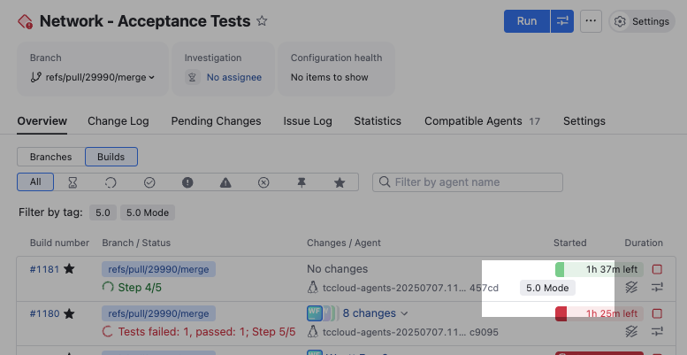

# tctest


[](https://goreportcard.com/report/github.com/katbyte/tctest)

A command-line utility to trigger builds in teamcity to run provider acceptance tests. Given a PR# it can find the files modified, tests to run and generate a TEST_PATTERN.    

Example:


basic help:


## Installation

To install `tctest` from the command line, you can run:
```bash
go install github.com/katbyte/tctest
```

## Configuration

While all commands can be configured from the command line, environment variables can be used instead. By creating a file such as [`set_env_example.sh`](.github/images/set_env_example.sh), it can then be sourced:
 

## Basic Usage

To run a build on a branch with a test pattern:
```bash
tctest branch master TestAcc -s ci.katbyte.me -b AzureRm -u katbyte
```
or when environment variables are set:
```bash
tctest branch master TestAcc
```

## For a PR

To run a build on the merge branch with a specific test pattern:
```bash
tctest pr 3232 TestAcc -s ci.katbyte.me -b AzureRm -u katbyte -r terraform-providers/terraform-provider-azurerm
```


If no test pattern is specified the modified files in the PR will be checked and it will be generated automatically:
```bash
tctest pr 3232
```

Multiple PRs can be specified at once
```bash
tctest pr 3232,5454,7676
````


To list all the tests discovered for a given PR:
```bash
tctest list 3232
```

To run tests against a PR and display results when complete:
```bash
tctest pr 3232 --wait
```

## Build results: 
*By TeamCity Build Number*

To show the PASS/FAIL/SKIP results for a TeamCity build number:
```bash
tctest results 12345
```

To wait for a running or queued build to complete and then show the results:
```bash
tctest results 12345 --wait
```

*By Github PR Number*

To show the PASS/FAIL/SKIP results for **all** TeamCity builds for a Github PR:
```bash
tctest results pr 12345
```
To show the PASS/FAIL/SKIP results for the **latest** TeamCity build for a Github PR:
```bash
tctest results pr 12345 --latest
```
To wait for a running or queued build to complete and then show the results:
```bash
tctest results pr 12345 --wait
```

# Allow User to add Tags to TC Build Runs

## Usage Examples

1. **Single tag:**
   ```bash
   ./tctest pr 123 --tag='5.0 Mode'
   ```
   

2. **Multiple tags:**
   ```bash
   ./tctest pr 123 --tag=urgent,regression
   ```

3. **Multiple tags (alternative syntax):**
   ```bash
   ./tctest pr 123 --tag=urgent --tag=regression
   ```

4. **With branch command:**
   ```bash
   ./tctest branch main "TestAcc" --tag=nightly,main-branch
   ```

5. **Via environment:**
   ```bash
   TCTEST_BUILD_TAGS=nightly,main-branch ./tctest pr 123
   ```

## How it works

1. The PR command triggers the build as usual
2. After the build is queued, it calls the TeamCity REST API to add tags
3. Each tag is sent as a separate POST request to `/app/rest/2018.1/builds/id:{buildID}/tags`
4. The request body contains just the tag text with `Content-Type: text/plain`

## API Details

- Endpoint: `POST /app/rest/2018.1/builds/id:{buildID}/tags`
- Content-Type: `text/plain`
- Body: The tag text (one tag per request)

## Error Handling

- If tagging fails, it shows a warning but doesn't fail the entire operation
- Empty tags are skipped
- Each tag is processed individually, so one failure doesn't affect others